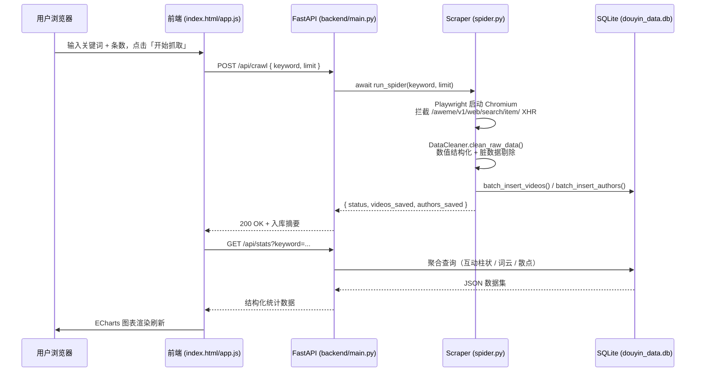

# 🎬 Douyin Topic Crawler

> **纯 AI Agent 驱动开发** · FastAPI 后端 · Playwright 动态抓取 · ECharts 数据看板

一个由多智能体（Multi-Agent）协作架构驱动、端到端自动化的抖音话题数据采集与可视化分析系统。所有功能模块——从爬虫、数据清洗、后端 API 到前端看板——均由专职 AI Agent 独立迭代开发，是探索 **LLM-Driven Software Engineering** 工作流的实践案例。

---

## ✨ 项目特性

| 特性 | 说明 |
|---|---|
| 🤖 **Agent 驱动开发** | 代码由 5 类专职 AI Agent 协作完成，每类 Agent 职责严格隔离 |
| 🕷️ **动态数据截获** | 使用 Playwright 拦截 `/aweme/v1/web/search/item/` XHR 响应，绝不依赖脆弱的 DOM 解析 |
| 🛡️ **反风控机制** | 随机延迟（2s–8s）+ 人机协作挂起，自动检测滑块验证码与登录拦截 |
| 🗄️ **结构化入库** | Pandas 数据清洗（`1.2w` → `12000`）+ SQLite 线程安全写入，杜绝脏数据 |
| ⚡ **异步 FastAPI** | 全 `async/await` 架构，`asyncio.to_thread` 卸载 SQLite 阻塞，支持高并发 |
| 📊 **动态看板** | ECharts 5 驱动：互动柱状图 + 标签词云图 + 粉丝-互动率散点图，完全前后端解耦 |
| 🔄 **一键抓取刷新** | 前端控制面板直接触发 `POST /api/crawl`，完成后自动刷新全部图表 |
| ✅ **自动化 QA** | `test_runner.py` 覆盖多关键词回归测试与 `limit` 边界值精确断言 |
| 📅 **Excel 导出** | 支持一键导出结构化数据报表（.xlsx），自动映射中文字段，包含完整互动指标 |

---

## 🏗️ 系统架构

### 多 Agent 协作分层

```
┌────────────────────────────────────────────────────────────────┐
│                      AI Agent 编排层                           │
│   .agent/rules/      ← 各 Agent 的行为约束与技术规范           │
│   .agent/workflows/  ← 可复用的 QA 回归测试工作流             │
└───────────────────┬────────────────────────────────────────────┘
                    │ 驱动
      ┌─────────────┼──────────────────────────────┐
      │             │                              │
      ▼             ▼                              ▼
┌──────────┐  ┌──────────┐  ┌──────────┐  ┌──────────┐  ┌──────────┐
│ Scraper  │  │   Data   │  │   API    │  │Frontend  │  │    QA    │
│  Agent   │  │  Agent   │  │  Agent   │  │  Agent   │  │  Agent   │
│          │  │          │  │          │  │          │  │          │
│spider.py │  │cleaner.py│  │  main.py │  │ app.js   │  │test_run  │
│          │  │database.p│  │          │  │index.html│  │ner.py    │
└────┬─────┘  └────┬─────┘  └────┬─────┘  └────┬─────┘  └──────────┘
     │              │              │              │
     ▼              ▼              ▼              ▼
 raw_data.json → douyin_data.db → REST API → ECharts 看板
```

### 数据流



### 目录结构

```
dgt/
├── backend/
│   ├── spider.py        # Scraper Agent — Playwright XHR 截获 + 反风控
│   ├── cleaner.py       # Data Agent   — 原始 JSON 清洗与结构化
│   ├── database.py      # Data Agent   — SQLite 并发安全写入
│   ├── main.py          # API Agent    — FastAPI 路由 + 静态文件挂载
│   ├── douyin_data.db   # SQLite 数据库（运行后生成）
│   └── user_data/       # Playwright 持久化 Cookie 目录
├── frontend/
│   ├── index.html       # Frontend Agent — 看板页面结构
│   ├── app.js           # Frontend Agent — ECharts 渲染 + API 交互
│   └── style.css        # Frontend Agent — 暗色玻璃态 UI 样式
├── test_runner.py        # QA Agent — 自动化回归测试脚本
├── run_workflow_auto.py  # 早期批量工作流脚本（已被 API 驱动版取代）
├── requirements.txt      # Python 依赖清单
└── .agent/
    ├── rules/            # Agent 行为约束规范 (always_on)
    │   ├── python-backend.md
    │   └── frontend-ui.md
    └── workflows/        # 可复用工作流 (slash commands)
        └── batch-keyword-test.md
```

---

## 🚀 快速开始 (Quick Start)

### 前置条件

- [Anaconda / Miniconda](https://docs.conda.io/en/latest/miniconda.html)
- Windows 10/11（已针对 `WindowsProactorEventLoopPolicy` 适配）
- 稳定的网络，可访问抖音

### 1. 克隆并激活环境

```bash
git clone https://github.com/orange-suli/douyin_topic_crawler.git
cd douyin_topic_crawler

# ⚠️ 本项目所有操作必须在此 Conda 环境下执行
conda create -n douyin-scrawl python=3.11 -y
conda activate douyin-scrawl
```

### 2. 安装依赖

```bash
pip install -r requirements.txt
pip install fastapi uvicorn

# 安装 Playwright Chromium 内核（仅首次需要）
playwright install chromium
```

> **requirements.txt** 当前包含：`playwright>=1.40.0`、`pytest-playwright`、`pandas`

### 3. 启动后端服务

```bash
# 在项目根目录下执行（必须激活 douyin-scrawl 环境）
conda activate douyin-scrawl
uvicorn backend.main:app --host 0.0.0.0 --port 8000 --reload
```

服务启动后，FastAPI 同时提供：
- **REST API**：`http://localhost:8000/api/`
- **前端看板**：`http://localhost:8000/`（静态文件由 FastAPI 挂载）
- **交互文档**：`http://localhost:8000/docs`

### 4. 使用看板抓取数据

打开浏览器访问 `http://localhost:8000`，在控制面板中：
1. 输入搜索关键词（如 `大模型`、`赛博朋克`）
2. 设置抓取条数上限（建议 5–20 条）
3. 点击 **🚀 开始抓取**

> ⚠️ **抓取时** Playwright 会自动打开一个 Chromium 窗口。若页面出现滑块验证码或登录弹窗，程序会在终端输出高亮警告并自动挂起，等待您在弹出的 Chromium 窗口中手动完成验证后自动恢复。

### 5. 可选：命令行直接抓取

```bash
conda activate douyin-scrawl

# 直接运行爬虫（抓取后自动清洗入库）
python backend/spider.py --keyword 大模型 --limit 10
```

### 6. 运行自动化回归测试

> 需确保后端服务已在另一终端中运行（步骤 3）

```bash
conda activate douyin-scrawl
python test_runner.py
```

测试脚本将依次：
- **阶段 A**：对 `["大模型", "赛博朋克", "极光"]` 执行标准回归（limit=5）
- **阶段 B**：对 `美食` 执行边界值精确截断验证（limit=8）
- 输出彩色汇总报告，包含爬虫状态、数据入库校验、limit 截断精度

---

## 📡 API 文档

| 方法 | 路由 | 说明 |
|------|------|------|
| `POST` | `/api/crawl` | 触发抓取流水线（爬取 → 清洗 → 入库），Body: `{ keyword, limit }` |
| `GET` | `/api/videos` | 获取视频列表，支持 `keyword`、`skip`、`limit` 分页参数 |
| `GET` | `/api/videos/detailed` | 获取视频详情列表（含 `video_url`、标签数组、粉丝数） |
| `GET` | `/api/stats` | 获取看板聚合数据（互动柱状、标签词云、散点图），支持 `keyword` 筛选 |
| `GET` | `/api/download/{keyword}` | 导出并下载指定关键词（或 `all`）的结构化 Excel 数据报表 |

完整交互式文档请访问：`http://localhost:8000/docs`

---

## 🗄️ 数据库 Schema

**`videos` 表**

| 字段 | 类型 | 说明 |
|------|------|------|
| `aweme_id` | TEXT (PK) | 视频唯一 ID |
| `desc` | TEXT | 视频标题/描述 |
| `create_time` | TEXT | 发布时间（`YYYY-MM-DD HH:MM:SS`） |
| `author_uid` | TEXT (FK) | 博主 UID |
| `digg_count` | INTEGER | 点赞数 |
| `comment_count` | INTEGER | 评论数 |
| `share_count` | INTEGER | 转发数 |
| `collect_count` | INTEGER | 收藏数 |
| `tags` | TEXT | 话题标签（逗号分隔） |
| `search_keyword` | TEXT | 来源搜索词 |
| `video_url` | TEXT | 可跳转的抖音视频链接 |

**`authors` 表**

| 字段 | 类型 | 说明 |
|------|------|------|
| `uid` | TEXT (PK) | 博主唯一 ID |
| `nickname` | TEXT | 博主昵称 |
| `follower_count` | INTEGER | 粉丝数（已结构化为整型） |

---

## 🧩 Agent 规范体系

本项目的 `.agent/` 目录存放了驱动 AI 开发过程的约束规范：

- **`.agent/rules/python-backend.md`**：后端技术约束（XHR 截获优先级、反风控延迟、异步架构、并发安全 SQLite）
- **`.agent/rules/frontend-ui.md`**：前端 UI 约束（统一 `API_BASE_URL`、优雅降级、ECharts Tooltip、响应式布局）
- **`.agent/workflows/batch-keyword-test.md`**：可调用的 `/batch-keyword-test` QA 工作流

---

## ⚠️ 免责声明 (Disclaimer)

**本项目仅供学习与研究 AI Agent 工作流使用。**

- 本项目展示了 LLM 驱动的多 Agent 协作软件开发方法论，所有数据采集功能仅用于技术演示与学术性探索。
- **严禁**将本项目用于任何商业数据采集、侵权内容爬取或违反平台服务协议的用途。
- 抖音（TikTok/Douyin）的数据归属于字节跳动及相关内容创作者，用户须自行遵守抖音《用户服务协议》及所在地区的相关法律法规。
- 作者不对任何因滥用本项目代码而产生的法律责任承担责任。

---

## 📄 License

[MIT License](LICENSE) · 2025 orange-suli
